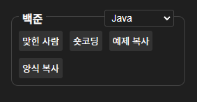
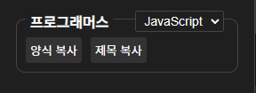
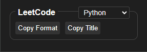

# AlgoBoost

BaekJoon, Programmers, LeetCode의 문제 양식, 제목, 예제 등을 자동으로 만들어주거나 원하는 탭 띄우는 확장 프로그램. SWEA는 당분간 지원 예정 없음.

추후 필요하면 SQL양식도 지원하도록 바꿀 생각이다.

[Algo](https://github.com/ohzeno/Algo), [Algo_Java](https://github.com/ohzeno/Algo_Java) 레포의 Utils.Forms에 있는 Python, JavaScript, Java 양식, Utils.boj_judge에 쓰는 input_datas 등을 자동으로 만들고 클립보드에 복사한다.

BaekJoon, Programmers, LeetCode의 문제 페이지에서만 popup에 기능과 언어 선택이 나타난다.

